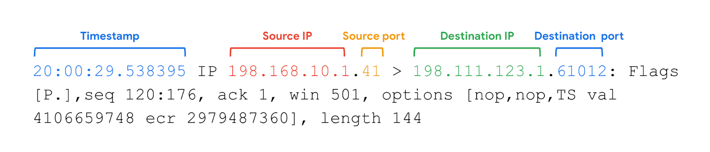

## Types of attack

### Network interception attacks

Intercept network traffic, interfere with it or steal data e.g. packet sniffing.

### Backdoor attacks

Weaknesses intentionally introduced by programmers / admins, or by a hacker after the initial intrusion.

## Possible impacts on an org

- Financial (loss of sales, fines, overtime)
- Reputation
- Public safety (e.g. government org hacked)

## Common DoS attacks

- SYN flood attack: Simulates lots of initial "synchronise" packets from the TCP/IP handshake, using up all the ports on the server.
- ICMP (status update protocol): Repeatedly send ICMP packets to server, server has to respond to all.
- Ping of death: Sending a malformed packet (especially ICMP) can cause a server to break.

## Network protocol analyser

Examples:

- SolarWinds NetFlow Traffic Analyzer
- ManageEngine OpManager
- Azure Network Watcher
- Wireshark
- tcpdump

### tcpdump

### Packet sniffing

- Passive: Data packets read in transit.
- Active: Data packets manipulated in transit.

VPN / HTTPS protects from this.

## IP spoofing

Common attacks:

- On-path attack: Malicious actor places themselves in the middle, and intercepts / alters data.
- Replay attack: Malicious actor repeats / delays a packet.
- Smurf attack: DDoS with authorised user's IP.
