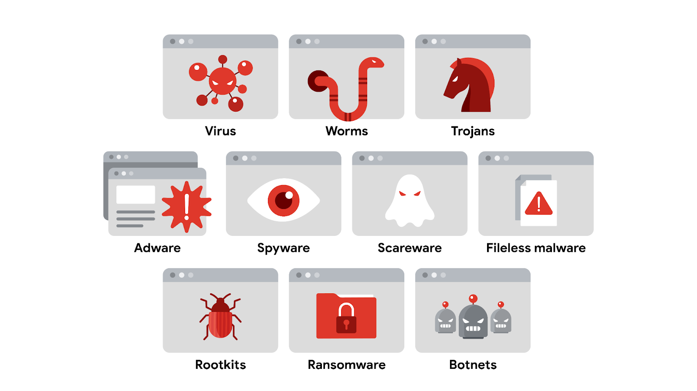

## Social engineering

### Typical stages

1. Prepare: Gather info, and how to exploit.
2. Establish trust (pretexting)
3. Use persuasion tactics
4. Disconnect from the target

### Signs of an attack

1. Baiting (e.g. leaving a USB)
2. Phishing
3. Quid pro quo (e.g. provide details, get X. Might not be intentional)
4. Tailgating (as in, through a physical barrier(?))
5. Watering hole (e.g. targeted malware on a niche site)

### How to prevent social engineering

Not fully convinced, but these were stated techniques:

- Implementing managerial controls
- Staying informed of trends
- Sharing knowledge with others

Also stated were the following, although they're more for end users:

- Stay alert of suspicious comms and unknown people
- Be cautious about sharing information
- Control curiosity when something seems too good to be true

## Phishing

"Phishing kits" can be used as a collection. Often contains:

- Malicious attachments
- Fake data-collection forms
- Fraudulent web links

## Malware

5 common types:

1. Virus: Have to be activated by user to start.
2. Worm: Can spread by itself.
3. Trojan: Pretends to be something legitimate.
4. Ransomware: Encrypts data, requires payment to decrypt.
5. Spyware: Gathers (and sells) data without consent.

Cryptojacking malware to mine crypto is common too. Signs of cryptojacking:

1. Slowdown
2. Increased CPU usage
3. Sudden system crashes
4. Fast draining batteries
5. High electricity costs

## Web exploits

- XSS (Cross-site scripting): Injection attack that inserts code into a vulnerable site. Types:
  - Reflected: Sent to server, activated during response (e.g. storing JS in a random field)
  - Stored: Injected directly on the server.
  - DOM-based: Exists in the webpage, doesn't need to be sent (e.g. ?loadfrom=).

### SQL injection

- In-band: Same communication channel to launch attack & gather results.
- Out-of-band: Different communication channels, e.g. somehow getting their own server / DB involved.
- Inferential: Not directly retrieving data, but can see effect by behaviour changes (e.g. errors).

### SQL injection prevention

- Prepared statements
- Input sanitization
- Input validation

## Threat modelling

Identifying assets, their vulnerabilities, and how each is exposed to threats. Typically 6 steps:

1. Define the scope
2. Identify threats (threat actors, internal or external), and an attack tree mapping threats to assets
3. Characterize the environment (applying an attacker mindset)
4. Analyse threats
5. Mitigate risks (avoid / transfer / reduce / accept)
6. Evaluate findings

### PASTA (Process for Attack Simulation and Threat Analysis)

1. Define business and security objectives
2. Define technical scope
3. Decompose the application (e.g. data flows, existing controls)
4. Perform threat analysis
5. Perform vulnerability analysis
6. Conduct attack modelling (create attack tree, like a flow chart with attack vectors)
7. Analyse risk and impact

There's also "Trike", "VAST" (Visual, Agile, Simple Threat), "STRIDE" (Spoofing, Tampering, Repudiation, Information Disclosure, Denial of Service, Elevation of Privilege).

## Feedback

This topic got a bit derailed into providing end user advice. Whilst sure, this is part of cybersecurity, it feels a bit too "entry level" for the 5th course in the cert.
